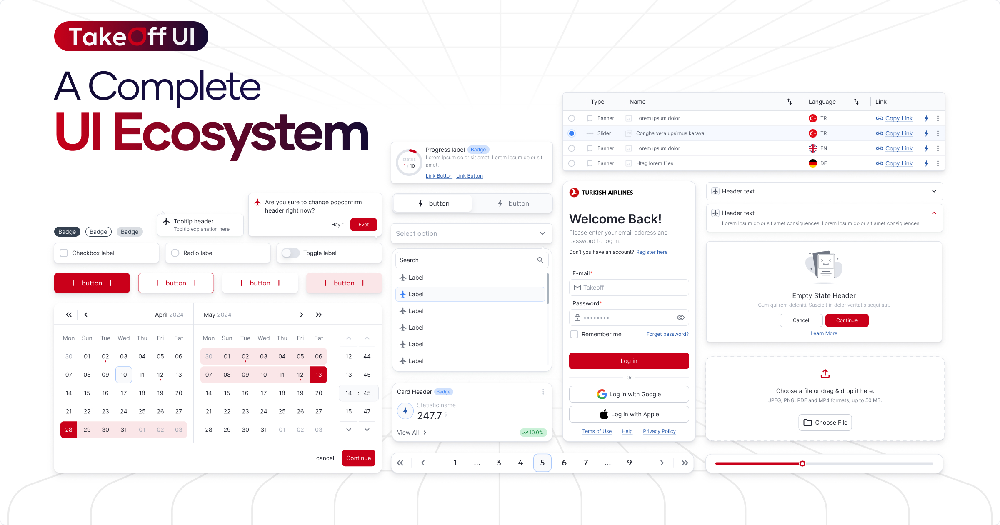

# @takeoff-ui/core

Takeoff UI is a comprehensive design system providing framework-agnostic web components developed with **Stencil.js**. The system is managed as a monorepo using **Turborepo**, enabling fast, incremental builds and consistent workflows across multiple packages for **React**, **Vue**, **Angular**.

## Documentation
Full API reference, guides, and examples are available at:  
https://takeoff-ui-blond.vercel.app

## Installation
https://takeoff-ui-blond.vercel.app/docs/Installation

## Contributing
See our [Contributing Guide](https://takeoff-ui-blond.vercel.app/docs/CONTRIBUTING) for details on issues, PRs, code style, and more.

## Contributors

## License

Licensed under the [Apache 2.0 License](LICENSE).