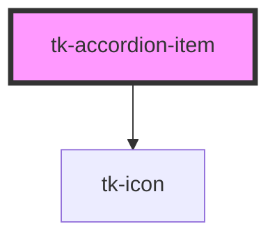

# tk-accordion-item

<!-- Auto Generated Below -->

## Properties

| Property     | Attribute     | Description                          | Type                     | Default     |
| ------------ | ------------- | ------------------------------------ | ------------------------ | ----------- |
| `active`     | `active`      | Sets if the accordion is active.     | `boolean`                | `false`     |
| `header`     | `header`      | Header text to display.              | `string`                 | `undefined` |
| `icon`       | `icon`        | Icon for accordion component.        | `IIconOptions \| string` | `undefined` |
| `itemKey`    | `item-key`    | Optional key for the accordion item. | `string`                 | `undefined` |
| `size`       | `size`        | Sets size for the component.         | `"base" \| "large"`      | `'base'`    |
| `toggleItem` | `toggle-item` | Toggle's the accordion item.         | `() => void`             | `undefined` |

## Slots

| Slot        | Description                                                        |
| ----------- | ------------------------------------------------------------------ |
| `"content"` | Custom content template.                                           |
| `"header"`  | Custom header template that overrides the header prop if provided. |

## Dependencies

### Depends on

- [tk-icon](../tk-icon)

### Graph

----------------------------------------------

*Built with [StencilJS](https://stenciljs.com/)*
