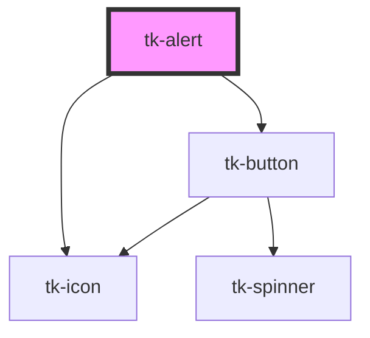

# tk-alert

<!-- Auto Generated Below -->

## Overview

The TkAlert component is designed to display contextual feedback messages, such as success, warnings, informational notices, and errors.

## Properties

| Property     | Attribute     | Description                                                                                    | Type                                                        | Default     |
| ------------ | ------------- | ---------------------------------------------------------------------------------------------- | ----------------------------------------------------------- | ----------- |
| `alignItems` | `align-items` | Alignment of the alert content ('start', 'center', or 'end').                                  | `"center" \| "end" \| "start"`                              | `'center'`  |
| `header`     | `header`      | The header text displayed at the top of the alert.                                             | `string`                                                    | `undefined` |
| `icon`       | `icon`        | The icon displayed in the alert. If not provided, a default icon is used based on the variant. | `IIconOptions \| string`                                    | `undefined` |
| `iconSize`   | `icon-size`   | Size of the icon displayed in the alert ('small', 'base', or 'large').                         | `"base" \| "large" \| "small" \| "xlarge"`                  | `'large'`   |
| `message`    | `message`     | The message text displayed within the alert.                                                   | `string \| string[]`                                        | `undefined` |
| `removable`  | `removable`   | The alert can be closed by the user.                                                           | `boolean`                                                   | `false`     |
| `type`       | `type`        | This field specifies the design type of the component.                                         | `"filled" \| "filledlight" \| "gradient" \| "outlined"`     | `'filled'`  |
| `variant`    | `variant`     | Defines the visual variant of the alert.                                                       | `"danger" \| "info" \| "neutral" \| "success" \| "warning"` | `'neutral'` |

## Slots

| Slot              | Description                                |
| ----------------- | ------------------------------------------ |
| `"footer-action"` | Custom actions template to default footer. |
| `"right-action"`  | Custom actions template to right content.  |

## Dependencies

### Depends on

- [tk-icon](../tk-icon)
- [tk-button](../tk-button)

### Graph

----------------------------------------------

*Built with [StencilJS](https://stenciljs.com/)*
