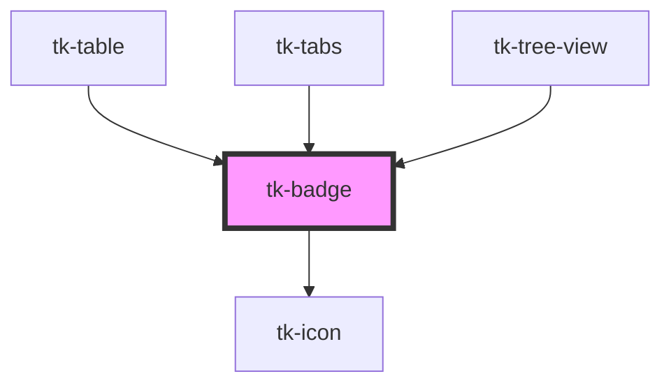

# tk-badge

<!-- Auto Generated Below -->

## Overview

The TkBadge component allows you to create a small badge for adding information like contextual data that needs to stand out and get noticed. It is also often useful in combination with other elements like a user avatar to show a number of new messages.

## Properties

| Property       | Attribute       | Description                                            | Type                                                                                                                                      | Default     |
| -------------- | --------------- | ------------------------------------------------------ | ----------------------------------------------------------------------------------------------------------------------------------------- | ----------- |
| `count`        | `count`         | Defines the number for the element.                    | `number \| string`                                                                                                                        | `undefined` |
| `dot`          | `dot`           | If true, shows a small dot on the badge.               | `boolean`                                                                                                                                 | `false`     |
| `icon`         | `icon`          | Specifies a material icon name to be displayed.        | `IIconOptions \| string`                                                                                                                  | `undefined` |
| `iconPosition` | `icon-position` | Defines the position of the icon.                      | `"left" \| "right"`                                                                                                                       | `'left'`    |
| `label`        | `label`         | Defines the label for the element.                     | `string`                                                                                                                                  | `undefined` |
| `rounded`      | `rounded`       | Makes the badge corners rounded.                       | `boolean`                                                                                                                                 | `false`     |
| `size`         | `size`          | Sets size for the component.                           | `"base" \| "large" \| "small"`                                                                                                            | `'base'`    |
| `type`         | `type`          | This field specifies the design type of the component. | `"filled" \| "filledlight" \| "outlined" \| "text"`                                                                                       | `'filled'`  |
| `variant`      | `variant`       | Determines the badge's variant for different styles.   | `"business" \| "cyan" \| "danger" \| "info" \| "neutral" \| "primary" \| "purple" \| "secondary" \| "success" \| "verified" \| "warning"` | `'primary'` |

## Dependencies

### Used by

 - [tk-table](../tk-table)
 - [tk-tabs](../tk-tabs)
 - [tk-tree-view](../tk-treeview)

### Depends on

- [tk-icon](../tk-icon)

### Graph

----------------------------------------------

*Built with [StencilJS](https://stenciljs.com/)*
