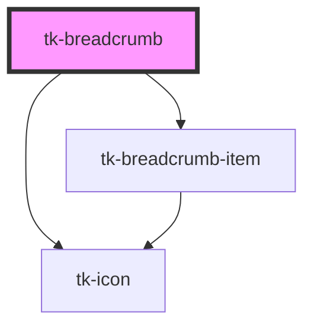

# tk-breadcrumb

<!-- Auto Generated Below -->

## Overview

The `TkBreadcrumb` provides a navigational aid, allowing users to keep track of their location within the application's hierarchy.

## Properties

| Property        | Attribute        | Description                                                                            | Type                                       | Default           |
| --------------- | ---------------- | -------------------------------------------------------------------------------------- | ------------------------------------------ | ----------------- |
| `model`         | `model`          | Array of breadcrumb items                                                              | `IBreadcrumbModel[]`                       | `undefined`       |
| `separator`     | `separator`      | Type of separator to use between breadcrumb items                                      | `"dot" \| "icon" \| "slash" \| "vertical"` | `'icon'`          |
| `separatorIcon` | `separator-icon` | Icon to use as separator when separator is set to 'icon'                               | `string`                                   | `'chevron_right'` |
| `type`          | `type`           | Defines the visual style of the component, possible values are 'basic' and 'outlined'. | `"basic" \| "outlined"`                    | `'basic'`         |

## Slots

| Slot        | Description                                         |
| ----------- | --------------------------------------------------- |
| `"default"` | Default slot to detect TkBreadcrumbItem components. |

## Dependencies

### Depends on

- [tk-icon](../tk-icon)
- [tk-breadcrumb-item](tk-breadcrumb-item)

### Graph

----------------------------------------------

*Built with [StencilJS](https://stenciljs.com/)*
