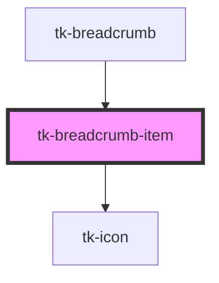

# tk-breadcrumb-item

<!-- Auto Generated Below -->

## Properties

| Property     | Attribute     | Description                           | Type                     | Default     |
| ------------ | ------------- | ------------------------------------- | ------------------------ | ----------- |
| `href`       | `href`        | URL for the item                      | `string`                 | `undefined` |
| `icon`       | `icon`        | Icon to display alongside the label   | `IIconOptions \| string` | `undefined` |
| `isCurrent`  | `is-current`  | Indicates if the item is the last one | `boolean`                | `false`     |
| `isExternal` | `is-external` | Whether the item is an external url   | `boolean`                | `false`     |
| `label`      | `label`       | Label text for the breadcrumb item    | `string`                 | `undefined` |

## Dependencies

### Used by

 - [tk-breadcrumb](..)

### Depends on

- [tk-icon](../../tk-icon)

### Graph

----------------------------------------------

*Built with [StencilJS](https://stenciljs.com/)*
