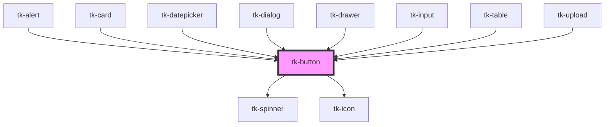

# tk-button

<!-- Auto Generated Below -->

## Overview

TkButton is an extension to standard input element with icons and theming.

## Properties

| Property       | Attribute       | Description                                                                        | Type                                                                                               | Default     |
| -------------- | --------------- | ---------------------------------------------------------------------------------- | -------------------------------------------------------------------------------------------------- | ----------- |
| `disabled`     | `disabled`      | Disables the button, preventing user interaction.                                  | `boolean`                                                                                          | `undefined` |
| `fullWidth`    | `full-width`    | Sets the button to full-width mode, making it span the container.                  | `boolean`                                                                                          | `undefined` |
| `href`         | `href`          | Sets the URL the button should navigate to when clicked (for type="link" buttons). | `string`                                                                                           | `undefined` |
| `icon`         | `icon`          | Specifies a material icon name to be displayed.                                    | `IIconOptions \| string`                                                                           | `undefined` |
| `iconPosition` | `icon-position` | Defines the position of the icon.                                                  | `"left" \| "right"`                                                                                | `'left'`    |
| `label`        | `label`         | Label text displayed inside the button.                                            | `string`                                                                                           | `''`        |
| `loading`      | `loading`       | Shows a loading icon inside the button.                                            | `boolean`                                                                                          | `undefined` |
| `mode`         | `mode`          | Sets the button type.                                                              | `"button" \| "link" \| "reset" \| "submit"`                                                        | `'button'`  |
| `rounded`      | `rounded`       | Makes the button round with an icon-only style.                                    | `boolean`                                                                                          | `undefined` |
| `size`         | `size`          | Sets size for the component.                                                       | `"base" \| "large" \| "small"`                                                                     | `'base'`    |
| `target`       | `target`        | Specifies where to open the linked document (for type="link" buttons).             | `string`                                                                                           | `undefined` |
| `type`         | `type`          | This field specifies the design type of the component.                             | `"elevated" \| "filled" \| "outlined" \| "text"`                                                   | `'filled'`  |
| `underline`    | `underline`     | Applies underline styling to the button (for type="link" buttons).                 | `boolean`                                                                                          | `undefined` |
| `variant`      | `variant`       | Determines the button's variant for different styles.                              | `"danger" \| "info" \| "neutral" \| "primary" \| "secondary" \| "success" \| "warning" \| "white"` | `'primary'` |

## Events

| Event      | Description                    | Type                      |
| ---------- | ------------------------------ | ------------------------- |
| `tk-click` | Emitted when the button click. | `CustomEvent<MouseEvent>` |

## Dependencies

### Used by

 - [tk-alert](../tk-alert)
 - [tk-card](../tk-card)
 - [tk-datepicker](../tk-datepicker)
 - [tk-dialog](../tk-dialog)
 - [tk-drawer](../tk-drawer)
 - [tk-input](../tk-input)
 - [tk-table](../tk-table)
 - [tk-upload](../tk-upload)

### Depends on

- [tk-spinner](../tk-spinner)
- [tk-icon](../tk-icon)

### Graph

----------------------------------------------

*Built with [StencilJS](https://stenciljs.com/)*
