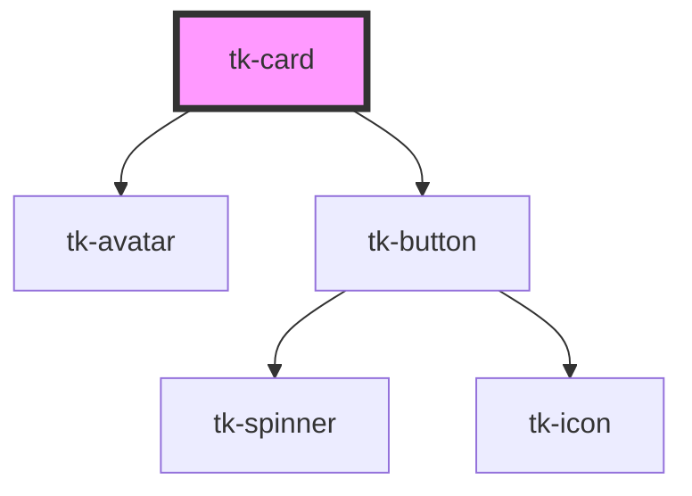

# tk-card

<!-- Auto Generated Below -->

## Overview

TkCard component description.

## Properties

| Property            | Attribute             | Description                                                                             | Type                                                                                                                                                                                                      | Default                                                                    |
| ------------------- | --------------------- | --------------------------------------------------------------------------------------- | --------------------------------------------------------------------------------------------------------------------------------------------------------------------------------------------------------- | -------------------------------------------------------------------------- |
| `avatarProps`       | `avatar-props`        | TO DO State hata verdiği için buraya alındı, düzeltilecek TkAvatar component properties | `any`                                                                                                                                                                                                     | `{     severity: 'light',     background: 'solid',     rounded: true,   }` |
| `containerStyle`    | `container-style`     | The style attribute of container element                                                | `any`                                                                                                                                                                                                     | `null`                                                                     |
| `contentStyle`      | `content-style`       | The style attribute of content element                                                  | `any`                                                                                                                                                                                                     | `null`                                                                     |
| `enableHoverShadow` | `enable-hover-shadow` | Controls whether the card shows a hover shadow effect                                   | `boolean`                                                                                                                                                                                                 | `false`                                                                    |
| `footerType`        | `footer-type`         | The mode of the footer                                                                  | `"basic" \| "divided" \| "light"`                                                                                                                                                                         | `'basic'`                                                                  |
| `header`            | `header`              | The header text                                                                         | `string`                                                                                                                                                                                                  | `undefined`                                                                |
| `headerPosition`    | `header-position`     | The position of the header                                                              | `"bottom" \| "top"`                                                                                                                                                                                       | `'top'`                                                                    |
| `headerType`        | `header-type`         | The type of the header                                                                  | `"basic" \| "dark" \| "divided" \| "light" \| "primary"`                                                                                                                                                  | `'basic'`                                                                  |
| `hideHeader`        | `hide-header`         | Controls whether the header is hidden                                                   | `boolean`                                                                                                                                                                                                 | `false`                                                                    |
| `horizontal`        | `horizontal`          | Controls whether the card is displayed horizontally                                     | `boolean`                                                                                                                                                                                                 | `false`                                                                    |
| `image`             | `image`               | The image source for the card                                                           | `string`                                                                                                                                                                                                  | `null`                                                                     |
| `imageOptions`      | `image-options`       | TO DO Options for the image display                                                     | `{ badge?: string; badgeIcon?: string; badgeIconPosition?: "left" \| "right"; windowed?: boolean; background?: boolean; backgroundUrl?: string; position?: "left" \| "right" \| "top" \| "background"; }` | `{     position: 'top',     background: false,     windowed: true,   }`    |
| `showAvatar`        | `show-avatar`         | Controls whether the header avatar is shown                                             | `boolean`                                                                                                                                                                                                 | `false`                                                                    |
| `showMenuButton`    | `show-menu-button`    | Controls whether the menu button is shown                                               | `boolean`                                                                                                                                                                                                 | `false`                                                                    |
| `subheader`         | `subheader`           | The subheader text                                                                      | `string`                                                                                                                                                                                                  | `undefined`                                                                |

## Slots

| Slot               | Description                                 |
| ------------------ | ------------------------------------------- |
| `"avatar"`         | Custom avatar template of card header.      |
| `"content"`        | Custom content template.                    |
| `"default"`        | Default slot to detect child to inner body. |
| `"footer"`         | Custom footer template.                     |
| `"footer-actions"` | Custom actions template to default footer.  |
| `"header"`         | Custom header template.                     |

## Dependencies

### Depends on

- [tk-avatar](../tk-avatar)
- [tk-button](../tk-button)

### Graph

----------------------------------------------

*Built with [StencilJS](https://stenciljs.com/)*
