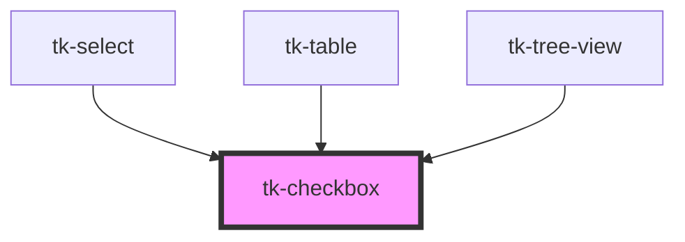

# tk-checkbox

<!-- Auto Generated Below -->

## Overview

The TkCheckbox component is another basic element for user input. You can use this to supply a way for the user to toggle an option.

## Properties

| Property        | Attribute       | Description                                          | Type                  | Default     |
| --------------- | --------------- | ---------------------------------------------------- | --------------------- | ----------- |
| `description`   | `description`   | The description sub text displayed.                  | `string`              | `undefined` |
| `disabled`      | `disabled`      | If true, the user cannot interact with the checkbox. | `boolean`             | `false`     |
| `indeterminate` | `indeterminate` | If true, the checkbox will be indeterminate.         | `boolean`             | `false`     |
| `invalid`       | `invalid`       | Indicates whether the input is in an invalid state   | `boolean`             | `false`     |
| `label`         | `label`         | Defines the label for the checkbox.                  | `string`              | `undefined` |
| `name`          | `name`          | Name of the checkbox                                 | `string`              | `undefined` |
| `type`          | `type`          | Determines the appearance types of the checkbox.     | `"card" \| "default"` | `'default'` |
| `value`         | `value`         | Sets the checkbox value                              | `boolean`             | `false`     |

## Events

| Event       | Description                                      | Type                   |
| ----------- | ------------------------------------------------ | ---------------------- |
| `tk-change` | Emitted when the checkbox checked state changes. | `CustomEvent<boolean>` |

## Slots

| Slot        | Description              |
| ----------- | ------------------------ |
| `"content"` | Custom content template. |

## Dependencies

### Used by

 - [tk-select](../tk-select)
 - [tk-table](../tk-table)
 - [tk-tree-view](../tk-treeview)

### Graph

----------------------------------------------

*Built with [StencilJS](https://stenciljs.com/)*
