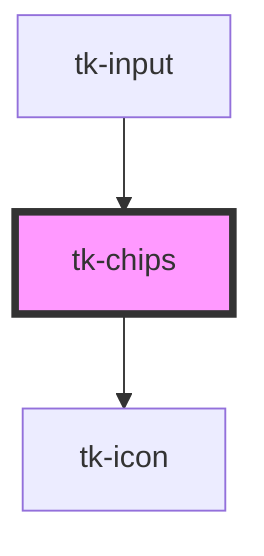

# tk-chips

<!-- Auto Generated Below -->

## Overview

The TkChip component is basically a simple UI block entity, representing for example more advanced underlying data, such as a contact, in a compact way. Chips can contain entities such as an avatar, text or an icon, optionally having a pointer too.

## Properties

| Property          | Attribute           | Description                                                                                | Type                                                                                                  | Default     |
| ----------------- | ------------------- | ------------------------------------------------------------------------------------------ | ----------------------------------------------------------------------------------------------------- | ----------- |
| `autoSelfDestroy` | `auto-self-destroy` | Determines whether the chip automatically removes itself when the close button is clicked. | `boolean`                                                                                             | `true`      |
| `disabled`        | `disabled`          | The disabled status.                                                                       | `boolean`                                                                                             | `false`     |
| `icon`            | `icon`              | Specifies a material icon name to be displayed.                                            | `IIconOptions \| string`                                                                              | `undefined` |
| `label`           | `label`             | The label to display inside the chip.                                                      | `string`                                                                                              | `undefined` |
| `removable`       | `removable`         | This property determines whether the chip component is removable.                          | `boolean`                                                                                             | `false`     |
| `size`            | `size`              | Sets size for the component.                                                               | `"base" \| "large" \| "small"`                                                                        | `'base'`    |
| `type`            | `type`              | This field specifies the design type of the component.                                     | `"avatar" \| "filled" \| "filledlight" \| "outlined"`                                                 | `'filled'`  |
| `value`           | `value`             | The value of the chips                                                                     | `any`                                                                                                 | `undefined` |
| `variant`         | `variant`           | The variant of the chip for styling.                                                       | `"danger" \| "info" \| "neutral" \| "primary" \| "secondary" \| "success" \| "verified" \| "warning"` | `'primary'` |

## Events

| Event       | Description                                                        | Type               |
| ----------- | ------------------------------------------------------------------ | ------------------ |
| `tk-remove` | When an element is deleted, it is triggered. It returns the label. | `CustomEvent<any>` |

## Dependencies

### Used by

 - [tk-input](../tk-input)

### Depends on

- [tk-icon](../tk-icon)

### Graph

----------------------------------------------

*Built with [StencilJS](https://stenciljs.com/)*
