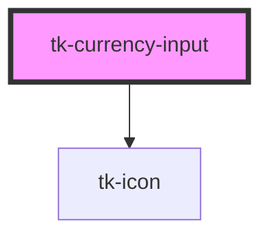

# tk-currency-input

<!-- Auto Generated Below -->

## Overview

The TkCurrencyInput component allows users to input phone numbers with country selection and validation.

## Properties

| Property             | Attribute             | Description                                                                                                                                                                                               | Type                           | Default     |
| -------------------- | --------------------- | --------------------------------------------------------------------------------------------------------------------------------------------------------------------------------------------------------- | ------------------------------ | ----------- |
| `allowNegative`      | `allow-negative`      | Allows negative values to be entered if set to true.                                                                                                                                                      | `boolean`                      | `false`     |
| `currencyList`       | `currency-list`       | List of available currencies. If not provided, it defaults to the internal currency list.                                                                                                                 | `ICurrency[]`                  | `undefined` |
| `decimalSeparator`   | `decimal-separator`   | Custom decimal separator to use for formatting. If provided, this will override the currency's default decimal separator. Example: "." for USD style, "," for EUR style                                   | `string`                       | `undefined` |
| `defaultCurrency`    | `default-currency`    | The default currency to use when the component is initialized. Default is 'TRY'.                                                                                                                          | `string`                       | `'TRY'`     |
| `disabled`           | `disabled`            | Disables the input field if set to true.                                                                                                                                                                  | `boolean`                      | `false`     |
| `error`              | `error`               | This is the error message that will be displayed.                                                                                                                                                         | `string`                       | `undefined` |
| `hint`               | `hint`                | Provided a hint or additional information about the input.                                                                                                                                                | `string`                       | `undefined` |
| `invalid`            | `invalid`             | Marks the input field as invalid if set to true.                                                                                                                                                          | `boolean`                      | `false`     |
| `label`              | `label`               | The label for the input field. If provided, it will be displayed above the input.                                                                                                                         | `string`                       | `undefined` |
| `name`               | `name`                | The name attribute for the input element. Useful for form submissions.                                                                                                                                    | `string`                       | `undefined` |
| `placeholder`        | `placeholder`         | Placeholder text for the input field.                                                                                                                                                                     | `string`                       | `undefined` |
| `precision`          | `precision`           | The number of decimal places to display in the formatted currency value. Default is 2, which is common for most currencies.                                                                               | `number`                       | `2`         |
| `readonly`           | `readonly`            | Makes the input field read-only if set to true.                                                                                                                                                           | `boolean`                      | `false`     |
| `showAsterisk`       | `show-asterisk`       | Displays a red asterisk (*) next to the label for visual emphasis.                                                                                                                                        | `boolean`                      | `false`     |
| `size`               | `size`                | Sets size for the component.                                                                                                                                                                              | `"base" \| "large" \| "small"` | `'base'`    |
| `thousandsSeparator` | `thousands-separator` | Custom thousands separator to use for formatting. If provided, this will override the currency's default thousands separator. Example: "," for USD style, "." for EUR style, " " for some European styles | `string`                       | `undefined` |
| `value`              | `value`               | The value of the input.                                                                                                                                                                                   | `number`                       | `0`         |

## Events

| Event       | Description                         | Type                |
| ----------- | ----------------------------------- | ------------------- |
| `tk-change` | Emitted when the value has changed. | `CustomEvent<any>`  |
| `tkBlur`    | Emitted when the input loses focus. | `CustomEvent<void>` |
| `tkFocus`   | Emitted when the input has focus.   | `CustomEvent<void>` |

## Dependencies

### Depends on

- [tk-icon](../tk-icon)

### Graph

----------------------------------------------

*Built with [StencilJS](https://stenciljs.com/)*
