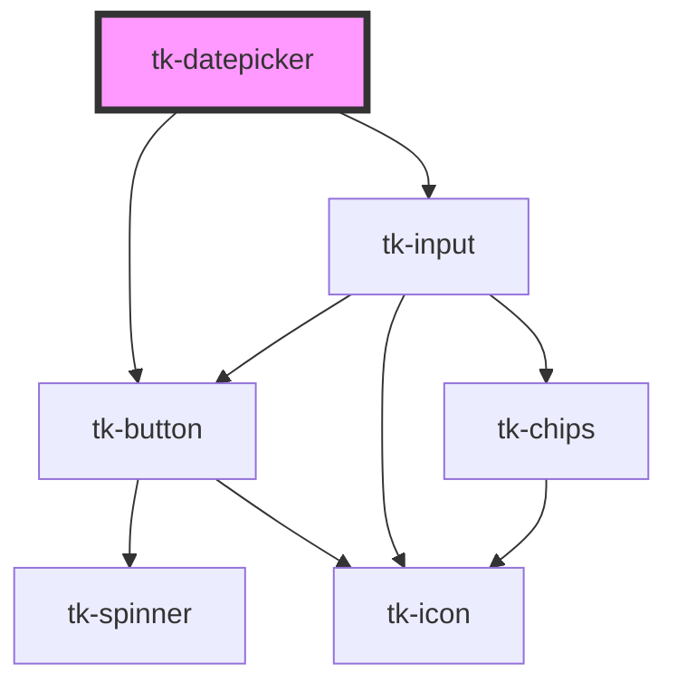

# tk-datepicker

<!-- Auto Generated Below -->

## Overview

The `TkDatepicker` component is a versatile and customizable date picker that supports `single` date and date `range` selection. It offers various display modes, localization, and customizable date formatting.

## Properties

| Property              | Attribute                 | Description                                                                                                                                                                                                                                                                                                                          | Type                                                     | Default            |
| --------------------- | ------------------------- | ------------------------------------------------------------------------------------------------------------------------------------------------------------------------------------------------------------------------------------------------------------------------------------------------------------------------------------ | -------------------------------------------------------- | ------------------ |
| `allowedDates`        | `allowed-dates`           | Array of dates that are allowed to be selected. All other dates will be disabled.  Note: Format should match dateFormat prop                                                                                                                                                                                                         | `string[]`                                               | `[]`               |
| `clearable`           | `clearable`               | Indicates whether the input of datepicker can be cleared                                                                                                                                                                                                                                                                             | `boolean`                                                | `false`            |
| `dateFormat`          | `date-format`             | Date format pattern                                                                                                                                                                                                                                                                                                                  | `string`                                                 | `'yyyy-MM-dd'`     |
| `disableMask`         | `disable-mask`            | Whether to disable input mask                                                                                                                                                                                                                                                                                                        | `boolean`                                                | `false`            |
| `disabled`            | `disabled`                | Whether the datepicker is disabled                                                                                                                                                                                                                                                                                                   | `boolean`                                                | `false`            |
| `disabledDates`       | `disabled-dates`          | Array of dates that are disabled for selection.  Format should match dateFormat prop                                                                                                                                                                                                                                                 | `string[]`                                               | `[]`               |
| `disabledWeekDays`    | `disabled-week-days`      | Disabled week days (0-6, where 0 is Sunday and 6 is Saturday) Example: [0,6] will disable Sunday and Saturday                                                                                                                                                                                                                        | `number[]`                                               | `[]`               |
| `error`               | `error`                   | Error message to display                                                                                                                                                                                                                                                                                                             | `string`                                                 | `undefined`        |
| `firstDayOfWeekIndex` | `first-day-of-week-index` | Defines the first day of the week. 0 for Monday, 1 for Tuesday, ..., 6 for Sunday. If not provided, the first day of the week is determined by the `locale` prop. If neither `firstDayOfWeekIndex` nor `locale` provide a value, defaults to Monday (0). Providing this prop overrides the locale setting for the start of the week. | `number`                                                 | `undefined`        |
| `footerType`          | `footer-type`             | The visual variant of the footer: 'basic', 'divided', or 'light'.                                                                                                                                                                                                                                                                    | `"basic" \| "divided" \| "light"`                        | `'basic'`          |
| `headerType`          | `header-type`             | Header visual variant                                                                                                                                                                                                                                                                                                                | `"basic" \| "dark" \| "divided" \| "light" \| "primary"` | `'basic'`          |
| `hint`                | `hint`                    | Hint text to display                                                                                                                                                                                                                                                                                                                 | `string`                                                 | `undefined`        |
| `hourStep`            | `hour-step`               | Hour increment step.                                                                                                                                                                                                                                                                                                                 | `number`                                                 | `1`                |
| `icon`                | `icon`                    | Specifies a material icon name to be displayed.                                                                                                                                                                                                                                                                                      | `IIconOptions \| string`                                 | `'calendar_month'` |
| `iconPosition`        | `icon-position`           | Defines the position of the icon.                                                                                                                                                                                                                                                                                                    | `"left" \| "right"`                                      | `'left'`           |
| `inline`              | `inline`                  | Whether to display inline panel                                                                                                                                                                                                                                                                                                      | `boolean`                                                | `false`            |
| `invalid`             | `invalid`                 | Whether the datepicker is in an invalid state                                                                                                                                                                                                                                                                                        | `boolean`                                                | `false`            |
| `label`               | `label`                   | Defines the label for the input                                                                                                                                                                                                                                                                                                      | `string`                                                 | `undefined`        |
| `locale`              | `locale`                  | Locale for date formatting                                                                                                                                                                                                                                                                                                           | `string`                                                 | `'en'`             |
| `maxDate`             | `max-date`                | Maximum selectable date                                                                                                                                                                                                                                                                                                              | `string`                                                 | `''`               |
| `maxTime`             | `max-time`                | Maximum selectable time (HH:mm format).                                                                                                                                                                                                                                                                                              | `string`                                                 | `undefined`        |
| `minDate`             | `min-date`                | Minimum selectable date                                                                                                                                                                                                                                                                                                              | `string`                                                 | `''`               |
| `minTime`             | `min-time`                | Minimum selectable time (HH:mm format).                                                                                                                                                                                                                                                                                              | `string`                                                 | `undefined`        |
| `minuteStep`          | `minute-step`             | Minute increment step.                                                                                                                                                                                                                                                                                                               | `number`                                                 | `1`                |
| `mode`                | `mode`                    | The selection mode of the date picker: 'single' for single date selection, 'range' for date range selection.                                                                                                                                                                                                                         | `"range" \| "single"`                                    | `'single'`         |
| `name`                | `name`                    | The name of the control.                                                                                                                                                                                                                                                                                                             | `string`                                                 | `undefined`        |
| `placeholder`         | `placeholder`             | Input placeholder text                                                                                                                                                                                                                                                                                                               | `string`                                                 | `undefined`        |
| `showAsterisk`        | `show-asterisk`           | Displays a red asterisk (*) next to the label for visual emphasis.                                                                                                                                                                                                                                                                   | `boolean`                                                | `false`            |
| `showTimePicker`      | `show-time-picker`        | Whether to show the timepicker panel next to the calendar.                                                                                                                                                                                                                                                                           | `boolean`                                                | `false`            |
| `size`                | `size`                    | Defines the size for the label                                                                                                                                                                                                                                                                                                       | `"base" \| "large" \| "small"`                           | `'base'`           |
| `timeFormat`          | `time-format`             | Time format: '12' or '24'.                                                                                                                                                                                                                                                                                                           | `"12" \| "24"`                                           | `'24'`             |
| `value`               | `value`                   | The value representing the selected date(s)                                                                                                                                                                                                                                                                                          | `IDateSelection \| string`                               | `undefined`        |

## Events

| Event             | Description                       | Type                                    |
| ----------------- | --------------------------------- | --------------------------------------- |
| `tk-change`       | Emitted on date selection changes | `CustomEvent<IDateSelection \| string>` |
| `tk-input-change` | Emitted on input value changes    | `CustomEvent<string>`                   |

## Methods

### `closePanel() => Promise<void>`

Closes the datepicker panel if it is open.

#### Returns

Type: `Promise<void>`

### `setToday() => Promise<void>`

Sets the date to today

#### Returns

Type: `Promise<void>`

## Slots

| Slot               | Description                                |
| ------------------ | ------------------------------------------ |
| `"footer"`         | Custom footer template.                    |
| `"footer-actions"` | Custom actions template to default footer. |

## Dependencies

### Depends on

- [tk-button](../tk-button)
- [tk-input](../tk-input)

### Graph

----------------------------------------------

*Built with [StencilJS](https://stenciljs.com/)*
