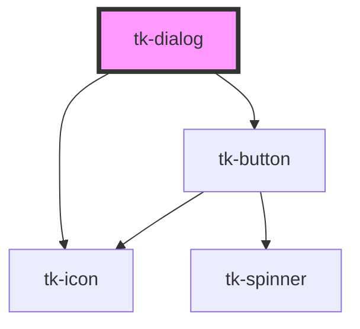

# tk-dialog

<!-- Auto Generated Below -->

## Overview

The `TkDialog` component provides a customizable modal dialog for displaying important information or requesting user input. It supports various configurations including different header types, variants, and customizable content.

## Properties

| Property          | Attribute           | Description                                                  | Type                                                     | Default     |
| ----------------- | ------------------- | ------------------------------------------------------------ | -------------------------------------------------------- | ----------- |
| `containerStyle`  | `container-style`   | The style attribute of container element                     | `any`                                                    | `null`      |
| `header`          | `header`            | The header text                                              | `string`                                                 | `undefined` |
| `headerType`      | `header-type`       | Header type                                                  | `"basic" \| "dark" \| "divided" \| "light" \| "primary"` | `'basic'`   |
| `hideBackdrop`    | `hide-backdrop`     | Controls whether the backdrop is shown                       | `boolean`                                                | `false`     |
| `isMaskBlur`      | `is-mask-blur`      | Controls whether the dialog has a blur background            | `boolean`                                                | `false`     |
| `maskVariant`     | `mask-variant`      | Appearance of the mask                                       | `"base" \| "dark" \| "darkest" \| "light" \| "lightest"` | `'base'`    |
| `preventDismiss`  | `prevent-dismiss`   | Prevents the dialog from being dismissed by clicking outside | `boolean`                                                | `false`     |
| `showCloseButton` | `show-close-button` | Controls whether the close button is shown                   | `boolean`                                                | `true`      |
| `showHeader`      | `show-header`       | Controls whether the header is shown                         | `boolean`                                                | `true`      |
| `showVariantSign` | `show-variant-sign` | Controls whether the variant sign is shown                   | `boolean`                                                | `true`      |
| `subheader`       | `subheader`         | The subheader text                                           | `string`                                                 | `undefined` |
| `variant`         | `variant`           | The variant of the dialog                                    | `"danger" \| "info" \| "success" \| "warning"`           | `'info'`    |
| `visible`         | `visible`           | Controls the visibility of the dialog                        | `boolean`                                                | `false`     |

## Events

| Event               | Description                                      | Type                   |
| ------------------- | ------------------------------------------------ | ---------------------- |
| `tk-close`          | Event emitted when the dialog is closed          | `CustomEvent<void>`    |
| `tk-open`           | Event emitted when the dialog is opened          | `CustomEvent<void>`    |
| `tk-visible-change` | Event emitted when the dialog visibility changes | `CustomEvent<boolean>` |

## Methods

### `close() => Promise<void>`

Requests to close the dialog by emitting a tk-close event.
Note: This method only emits an event. The dialog will only close if the parent component
listens for this event and updates the 'visible' prop to false.

#### Returns

Type: `Promise<void>`

### `open() => Promise<void>`

Requests to open the dialog by emitting a tk-open event.
Note: This method only emits an event. The dialog will only open if the parent component
listens for this event and updates the 'visible' prop to true.

#### Returns

Type: `Promise<void>`

## Slots

| Slot               | Description                                    |
| ------------------ | ---------------------------------------------- |
| `"container"`      | Custom container template.                     |
| `"content"`        | Custom content template.                       |
| `"default"`        | Default slot to detect child to inner content. |
| `"footer"`         | Custom footer template.                        |
| `"footer-actions"` | Custom actions template to default footer.     |
| `"header"`         | Custom header template.                        |

## Dependencies

### Depends on

- [tk-icon](../tk-icon)
- [tk-button](../tk-button)

### Graph

----------------------------------------------

*Built with [StencilJS](https://stenciljs.com/)*
