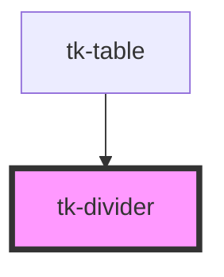

# tk-divider

<!-- Auto Generated Below -->

## Overview

TkDivider is a component that allows you to separate different sections, elements and content.

## Properties

| Property      | Attribute     | Description                                        | Type                         | Default        |
| ------------- | ------------- | -------------------------------------------------- | ---------------------------- | -------------- |
| `mx`          | `mx`          | Controls vertical spacing                          | `number \| string`           | `undefined`    |
| `my`          | `my`          | Controls horizontal spacing                        | `number \| string`           | `undefined`    |
| `orientation` | `orientation` | Controls the orientation of the divider component. | `"horizontal" \| "vertical"` | `'horizontal'` |

## Dependencies

### Used by

 - [tk-table](../tk-table)

### Graph

----------------------------------------------

*Built with [StencilJS](https://stenciljs.com/)*
