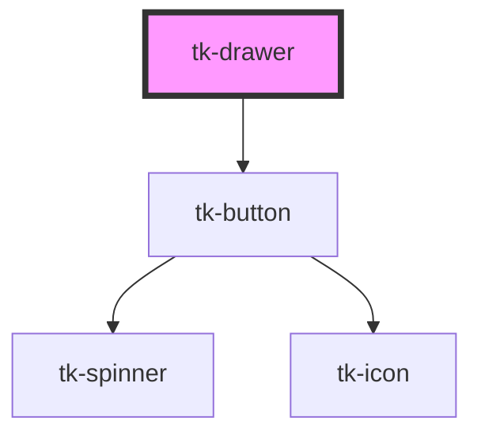

# tk-drawer

<!-- Auto Generated Below -->

## Overview

The `TkDrawer` is a container component displayed as an overlay. It supports various features such as different header and footer types, multiple variants, and flexible positioning, making it suitable for a wide range of use cases.

## Properties

| Property         | Attribute         | Description                                                   | Type                                                      | Default     |
| ---------------- | ----------------- | ------------------------------------------------------------- | --------------------------------------------------------- | ----------- |
| `containerStyle` | `container-style` | The style attribute of container element                      | `any`                                                     | `null`      |
| `footerType`     | `footer-type`     | The mode of the footer                                        | `"basic" \| "divided" \| "light"`                         | `'basic'`   |
| `header`         | `header`          | Text to display in the drawer header                          | `string`                                                  | `undefined` |
| `headerType`     | `header-type`     | The type of the header                                        | `"basic" \| "dark" \| "divided" \| "light" \| "primary"`  | `'basic'`   |
| `hideBackdrop`   | `hide-backdrop`   | Controls whether the backdrop is shown                        | `boolean`                                                 | `false`     |
| `hideCloseIcon`  | `hide-close-icon` | Controls whether to hide the close icon                       | `boolean`                                                 | `false`     |
| `maskVariant`    | `mask-variant`    | Appearance of the mask                                        | `"base" \| "dark" \| "darkest" \| "light" \| "lightest"`  | `'base'`    |
| `open`           | `open`            | Controls whether the drawer is open or closed                 | `boolean`                                                 | `false`     |
| `position`       | `position`        | Determines the position of the drawer                         | `"bottom" \| "full-screen" \| "left" \| "right" \| "top"` | `'right'`   |
| `preventDismiss` | `prevent-dismiss` | Prevents the drawer from being dismissed by clicking outside  | `boolean`                                                 | `false`     |
| `unblockScroll`  | `unblock-scroll`  | Controls whether to unblock scrolling when the drawer is open | `boolean`                                                 | `false`     |

## Events

| Event              | Description                                  | Type                   |
| ------------------ | -------------------------------------------- | ---------------------- |
| `tk-drawer-change` | Emitted when the drawer's open state changes | `CustomEvent<boolean>` |
| `tk-drawer-close`  | Emitted when the drawer is closed            | `CustomEvent<void>`    |
| `tk-drawer-enter`  | Emitted when the drawer starts to enter      | `CustomEvent<void>`    |
| `tk-drawer-leave`  | Emitted when the drawer starts to leave      | `CustomEvent<void>`    |
| `tk-drawer-open`   | Emitted when the drawer is opened            | `CustomEvent<void>`    |

## Methods

### `close() => Promise<void>`

Closes the drawer by emitting a tk-drawer-close event
Parent components should listen for this event and update the open prop

#### Returns

Type: `Promise<void>`

### `show() => Promise<void>`

Opens the drawer by emitting a tk-drawer-open event
Parent components should listen for this event and update the open prop

#### Returns

Type: `Promise<void>`

## Slots

| Slot              | Description                        |
| ----------------- | ---------------------------------- |
| `"container"`     | Custom container template.         |
| `"content"`       | Custom inner body template.        |
| `"footer"`        | Custom footer template.            |
| `"header"`        | Custom header template.            |
| `"header-action"` | Custom actions template of header. |

## Dependencies

### Depends on

- [tk-button](../tk-button)

### Graph

----------------------------------------------

*Built with [StencilJS](https://stenciljs.com/)*
