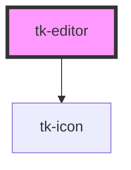

# tk-editor

<!-- Auto Generated Below -->

## Overview

TkEditor is a WYSIWYG editor component that wraps Tiptap editor.

## Properties

| Property               | Attribute                | Description                                                        | Type                                                  | Default     |
| ---------------------- | ------------------------ | ------------------------------------------------------------------ | ----------------------------------------------------- | ----------- |
| `contentStyle`         | `content-style`          | The style attribute of tabs item element                           | `any`                                                 | `null`      |
| `customToolbarButtons` | `custom-toolbar-buttons` | Custom toolbar buttons for extensions                              | `TkEditorCustomButton[]`                              | `[]`        |
| `disabled`             | `disabled`               | Whether the editor is disabled                                     | `boolean`                                             | `false`     |
| `error`                | `error`                  | This is the error message that will be displayed.                  | `string`                                              | `undefined` |
| `extensions`           | `extensions`             | Custom extensions                                                  | `AnyExtension[]`                                      | `[]`        |
| `hideToolbar`          | `hide-toolbar`           | Whether to hide the toolbar                                        | `boolean`                                             | `false`     |
| `hint`                 | `hint`                   | Provided a hint or additional information about the input.         | `string`                                              | `undefined` |
| `invalid`              | `invalid`                | Indicates whether the editor is in an invalid state                | `boolean`                                             | `false`     |
| `label`                | `label`                  | The label for the toggle                                           | `string`                                              | `undefined` |
| `placeholder`          | `placeholder`            | The placeholder text when editor is empty                          | `string`                                              | `undefined` |
| `readonly`             | `readonly`               | Whether the editor is readonly                                     | `boolean`                                             | `false`     |
| `showAsterisk`         | `show-asterisk`          | Displays a red asterisk (*) next to the label for visual emphasis. | `boolean`                                             | `false`     |
| `toolbar`              | `toolbar`                | Toolbar configuration                                              | `(TkEditorDefaultButton \| TkEditorCustomButton)[][]` | `undefined` |
| `value`                | `value`                  | The value of the editor                                            | `string`                                              | `''`        |

## Events

| Event       | Description                         | Type                  |
| ----------- | ----------------------------------- | --------------------- |
| `tk-change` | Emitted when editor content changes | `CustomEvent<string>` |
| `tkBlur`    | Emitted when editor loses focus     | `CustomEvent<void>`   |
| `tkFocus`   | Emitted when editor gets focus      | `CustomEvent<void>`   |

## Methods

### `getContent(format?: "json" | "html" | "text") => Promise<JSONContent | string>`

Gets the current content of the editor

#### Parameters

| Name     | Type                         | Description |
| -------- | ---------------------------- | ----------- |
| `format` | `"html" \| "text" \| "json"` |             |

#### Returns

Type: `Promise<string | JSONContent>`

### `getEditor() => Promise<Editor>`

Returns the Tiptap Editor instance

#### Returns

Type: `Promise<Editor>`

### `setContent(content: string) => Promise<void>`

Sets the content of the editor

#### Parameters

| Name      | Type     | Description |
| --------- | -------- | ----------- |
| `content` | `string` |             |

#### Returns

Type: `Promise<void>`

## Dependencies

### Depends on

- [tk-icon](../tk-icon)

### Graph

----------------------------------------------

*Built with [StencilJS](https://stenciljs.com/)*
