# tk-icon

<!-- Auto Generated Below -->

## Overview

The TkIcon component allows you to create a icon for adding visual information. It is also often useful in combination with other elements.
This component uses Google's Material Symbols icons. For a complete list of available icon names, please visit:
https://fonts.google.com/icons?icon.set=Material+Symbols

## Properties

| Property          | Attribute          | Description                                                           | Type                                                                                               | Default      |
| ----------------- | ------------------ | --------------------------------------------------------------------- | -------------------------------------------------------------------------------------------------- | ------------ |
| `backgroundColor` | `background-color` | The background color of the sign (custom variant)                     | `string`                                                                                           | `undefined`  |
| `borderColor`     | `border-color`     | The border color of the sign (custom variant)                         | `string`                                                                                           | `undefined`  |
| `color`           | `color`            | The color of the icon                                                 | `string`                                                                                           | `undefined`  |
| `fill`            | `fill`             | Indicates whether the icon should be filled                           | `boolean`                                                                                          | `undefined`  |
| `icon`            | `icon`             | Specifies a material icon.                                            | `string`                                                                                           | `undefined`  |
| `iconColor`       | `icon-color`       | The color of the icon (custom variant)                                | `string`                                                                                           | `undefined`  |
| `iconTag`         | `icon-tag`         | The HTML tag to use for the icon element.                             | `"i" \| "span"`                                                                                    | `'i'`        |
| `iconType`        | `icon-type`        | Specifies the type of the icon to be displayed.                       | `"outlined" \| "rounded" \| "sharp"`                                                               | `'outlined'` |
| `sign`            | `sign`             | Controls whether the icon is shown as a sign (previously 'card' type) | `boolean`                                                                                          | `false`      |
| `size`            | `size`             | Sets size for the component.                                          | `"base" \| "large" \| "medium" \| "small" \| "xlarge" \| "xsmall" \| "xxlarge"`                    | `'base'`     |
| `variant`         | `variant`          | The variant of the icon.                                              | `"danger" \| "info" \| "neutral" \| "primary" \| "secondary" \| "success" \| "warning" \| "white"` | `'primary'`  |

## Dependencies

### Used by

 - [tk-accordion-item](../tk-accordion)
 - [tk-alert](../tk-alert)
 - [tk-badge](../tk-badge)
 - [tk-breadcrumb](../tk-breadcrumb)
 - [tk-breadcrumb-item](../tk-breadcrumb/tk-breadcrumb-item)
 - [tk-button](../tk-button)
 - [tk-chips](../tk-chips)
 - [tk-currency-input](../tk-currency-input)
 - [tk-dialog](../tk-dialog)
 - [tk-editor](../tk-editor)
 - [tk-input](../tk-input)
 - [tk-pagination](../tk-pagination)
 - [tk-phone-input](../tk-phone-input)
 - [tk-slider](../tk-slider)
 - [tk-table](../tk-table)
 - [tk-tabs](../tk-tabs)
 - [tk-toggle-button](../tk-toggle-button)
 - [tk-tooltip](../tk-tooltip)
 - [tk-tree-view](../tk-treeview)
 - [tk-upload](../tk-upload)

### Graph

```mermaid
graph TD;
  tk-accordion-item --> tk-icon
  tk-alert --> tk-icon
  tk-badge --> tk-icon
  tk-breadcrumb --> tk-icon
  tk-breadcrumb-item --> tk-icon
  tk-button --> tk-icon
  tk-chips --> tk-icon
  tk-currency-input --> tk-icon
  tk-dialog --> tk-icon
  tk-editor --> tk-icon
  tk-input --> tk-icon
  tk-pagination --> tk-icon
  tk-phone-input --> tk-icon
  tk-slider --> tk-icon
  tk-table --> tk-icon
  tk-tabs --> tk-icon
  tk-toggle-button --> tk-icon
  tk-tooltip --> tk-icon
  tk-tree-view --> tk-icon
  tk-upload --> tk-icon
  style tk-icon fill:#f9f,stroke:#333,stroke-width:4px
```

----------------------------------------------

*Built with [StencilJS](https://stenciljs.com/)*
