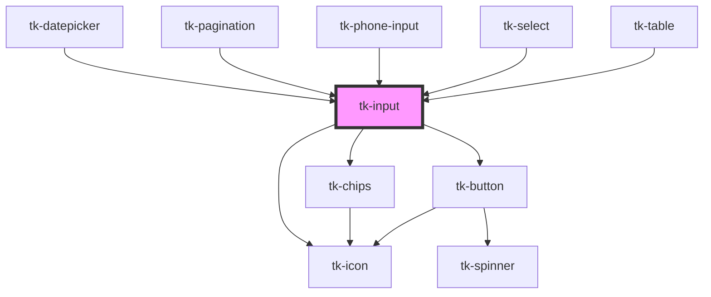

# tk-input

<!-- Auto Generated Below -->

## Overview

The TkInput component is used to capture text input from the user.

## Properties

| Property           | Attribute            | Description                                                                                                                                                                                                                                                                                                                                   | Type                                                       | Default     |
| ------------------ | -------------------- | --------------------------------------------------------------------------------------------------------------------------------------------------------------------------------------------------------------------------------------------------------------------------------------------------------------------------------------------- | ---------------------------------------------------------- | ----------- |
| `chipLabelKey`     | `chip-label-key`     | The key to use for option labels                                                                                                                                                                                                                                                                                                              | `string`                                                   | `'label'`   |
| `chipOptions`      | `chip-options`       | Sets options for all chips rendered in chips mode.                                                                                                                                                                                                                                                                                            | `IChipOptions`                                             | `undefined` |
| `clearable`        | `clearable`          | Indicates whether the input can be cleared                                                                                                                                                                                                                                                                                                    | `boolean`                                                  | `false`     |
| `disabled`         | `disabled`           | the user cannot interact with the input.                                                                                                                                                                                                                                                                                                      | `boolean`                                                  | `false`     |
| `error`            | `error`              | This is the error message that will be displayed.                                                                                                                                                                                                                                                                                             | `string`                                                   | `undefined` |
| `hint`             | `hint`               | Provided a hint or additional information about the input.                                                                                                                                                                                                                                                                                    | `string`                                                   | `undefined` |
| `icon`             | `icon`               | Specifies a material icon name to be displayed.                                                                                                                                                                                                                                                                                               | `IIconOptions \| IMultiIconOptions \| string`              | `undefined` |
| `iconPosition`     | `icon-position`      | Defines the position of the icon.                                                                                                                                                                                                                                                                                                             | `"left" \| "right"`                                        | `'left'`    |
| `invalid`          | `invalid`            | Indicates whether the input is in an invalid state                                                                                                                                                                                                                                                                                            | `boolean`                                                  | `false`     |
| `label`            | `label`              | Defines the label for the input.                                                                                                                                                                                                                                                                                                              | `string`                                                   | `undefined` |
| `maskOptions`      | `mask-options`       | The maskOptions prop is used to define masking configurations supported by the Cleave.js library. With this prop, you can specify any masking options described in the Cleave.js documentation (https://nosir.github.io/cleave.js/). For example, you can configure it for formatting dates, phone numbers, or credit card numbers as needed. | `IInputMaskOptions`                                        | `undefined` |
| `max`              | `max`                | Maximum value for number inputs                                                                                                                                                                                                                                                                                                               | `number \| string`                                         | `undefined` |
| `min`              | `min`                | Minimum value for number inputs                                                                                                                                                                                                                                                                                                               | `number \| string`                                         | `undefined` |
| `mode`             | `mode`               | input type                                                                                                                                                                                                                                                                                                                                    | `"chips" \| "counter" \| "number" \| "password" \| "text"` | `'text'`    |
| `name`             | `name`               | The name of the control, which is submitted with the form data.                                                                                                                                                                                                                                                                               | `string`                                                   | `undefined` |
| `placeholder`      | `placeholder`        | Placeholder text displayed when the input is empty.                                                                                                                                                                                                                                                                                           | `string`                                                   | `undefined` |
| `pre`              | `pre`                | Defines the prefix of the input;                                                                                                                                                                                                                                                                                                              | `string`                                                   | `undefined` |
| `readonly`         | `readonly`           | If `true`, the user cannot modify the value.                                                                                                                                                                                                                                                                                                  | `boolean`                                                  | `false`     |
| `showAsterisk`     | `show-asterisk`      | Displays a red asterisk (*) next to the label for visual emphasis.                                                                                                                                                                                                                                                                            | `boolean`                                                  | `false`     |
| `showSafetyStatus` | `show-safety-status` | if type = password safety status bar visible                                                                                                                                                                                                                                                                                                  | `boolean`                                                  | `false`     |
| `size`             | `size`               | Sets size for the component.                                                                                                                                                                                                                                                                                                                  | `"base" \| "large" \| "small"`                             | `'base'`    |
| `step`             | `step`               | Sets step for decimal value with mode number                                                                                                                                                                                                                                                                                                  | `string`                                                   | `undefined` |
| `value`            | `value`              | The value of the input.                                                                                                                                                                                                                                                                                                                       | `any[] \| number \| string \| string[]`                    | `undefined` |

## Events

| Event            | Description                              | Type                |
| ---------------- | ---------------------------------------- | ------------------- |
| `tk-blur`        | Emitted when the input loses focus.      | `CustomEvent<void>` |
| `tk-change`      | Emitted when the value has changed.      | `CustomEvent<any>`  |
| `tk-clear-click` | Emitted when the clear button has click. | `CustomEvent<void>` |
| `tk-focus`       | Emitted when the input has focus.        | `CustomEvent<void>` |

## Methods

### `setFocus() => Promise<void>`

Sets focus on the specified `tk-input`. Use this method instead of the global
`input.focus()`.

#### Returns

Type: `Promise<void>`

## Dependencies

### Used by

 - [tk-datepicker](../tk-datepicker)
 - [tk-pagination](../tk-pagination)
 - [tk-phone-input](../tk-phone-input)
 - [tk-select](../tk-select)
 - [tk-table](../tk-table)

### Depends on

- [tk-chips](../tk-chips)
- [tk-icon](../tk-icon)
- [tk-button](../tk-button)

### Graph

----------------------------------------------

*Built with [StencilJS](https://stenciljs.com/)*
