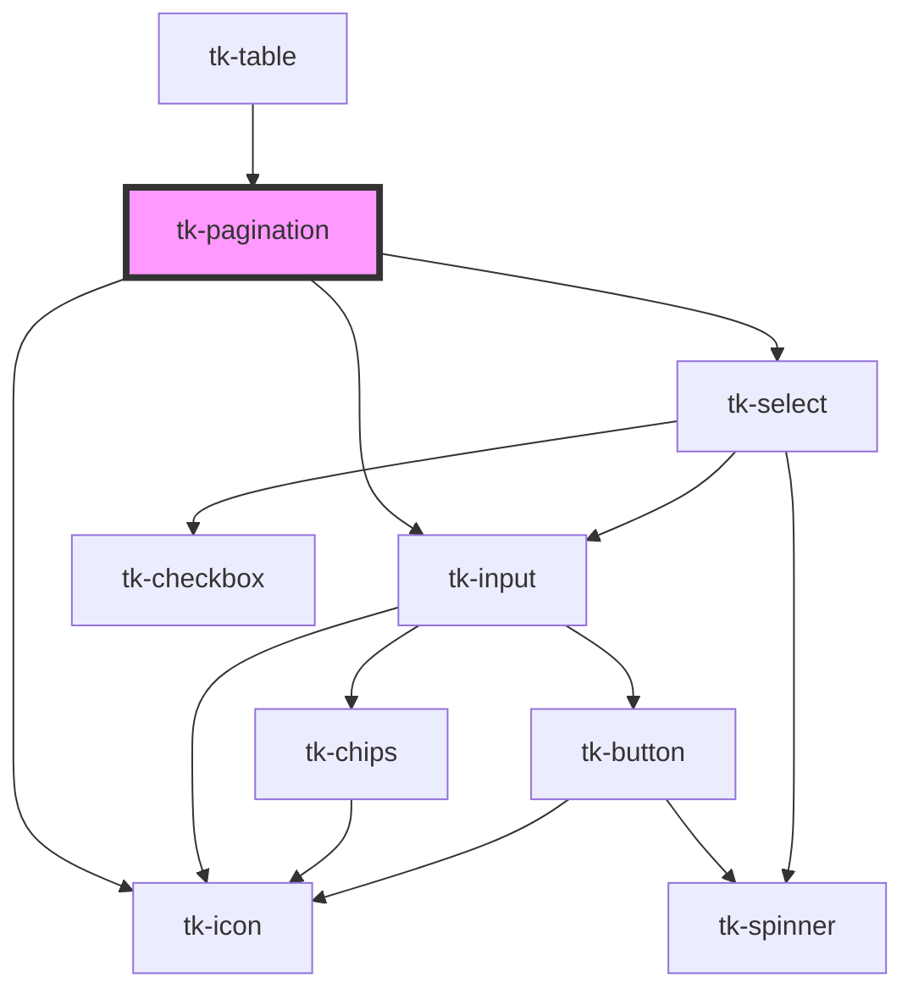

# tk-pagination

<!-- Auto Generated Below -->

## Overview

TkPagination component description.

## Properties

| Property             | Attribute               | Description                                                 | Type                                | Default           |
| -------------------- | ----------------------- | ----------------------------------------------------------- | ----------------------------------- | ----------------- |
| `currentPage`        | `current-page`          | The current page of the pagination.                         | `number`                            | `1`               |
| `mode`               | `mode`                  | The mode of the pagination                                  | `"compact" \| "compact-expanded"`   | `undefined`       |
| `rounded`            | `rounded`               | Whether the pagination elements should have rounded corners | `boolean`                           | `false`           |
| `rowsPerPage`        | `rows-per-page`         | Number of items per page.                                   | `number`                            | `10`              |
| `rowsPerPageOptions` | `rows-per-page-options` | Number of items per page options                            | `number[]`                          | `[5, 10, 20, 50]` |
| `totalItems`         | `total-items`           | Number of total items.                                      | `number`                            | `0`               |
| `type`               | `type`                  | The type of the pagination                                  | `"grouped" \| "outlined" \| "text"` | `'outlined'`      |

## Events

| Event                     | Description                        | Type                                                                                     |
| ------------------------- | ---------------------------------- | ---------------------------------------------------------------------------------------- |
| `tk-next-page`            | Pagination next button click event | `CustomEvent<{ page: number; }>`                                                         |
| `tk-page-change`          | Pagination page change event       | `CustomEvent<{ page: number; totalPages: number; startItem: number; endItem: number; }>` |
| `tk-prev-page`            | Pagination prev button click event | `CustomEvent<{ page: number; }>`                                                         |
| `tk-rows-per-page-change` | RowsPerPage change event           | `CustomEvent<number>`                                                                    |

## Dependencies

### Used by

 - [tk-table](../tk-table)

### Depends on

- [tk-icon](../tk-icon)
- [tk-input](../tk-input)
- [tk-select](../tk-select)

### Graph

----------------------------------------------

*Built with [StencilJS](https://stenciljs.com/)*
