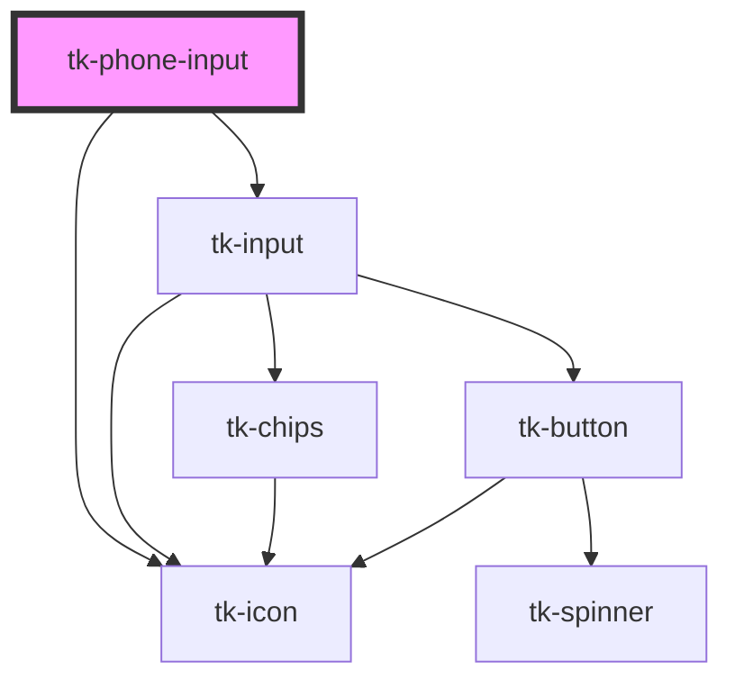

# tk-phone-input

<!-- Auto Generated Below -->

## Overview

The TkPhoneInput component allows users to input phone numbers with country selection and validation.

## Properties

| Property         | Attribute         | Description                                                                                                           | Type                           | Default     |
| ---------------- | ----------------- | --------------------------------------------------------------------------------------------------------------------- | ------------------------------ | ----------- |
| `countryList`    | `country-list`    | The list of countries to display in the dropdown. Can be provided as an array of Country objects or as a JSON string. | `ICountry[]`                   | `undefined` |
| `defaultCountry` | `default-country` | The default country to select (ISO country code).                                                                     | `string`                       | `'TR'`      |
| `disabled`       | `disabled`        | Whether the input is disabled. *                                                                                      | `boolean`                      | `false`     |
| `error`          | `error`           | This is the error message that will be displayed.                                                                     | `string`                       | `undefined` |
| `hint`           | `hint`            | Provided a hint or additional information about the input.                                                            | `string`                       | `undefined` |
| `invalid`        | `invalid`         | Indicates whether the input is in an invalid state                                                                    | `boolean`                      | `false`     |
| `label`          | `label`           | The label for the phone input.                                                                                        | `string`                       | `undefined` |
| `placeholder`    | `placeholder`     | Placeholder text for the phone input.                                                                                 | `string`                       | `undefined` |
| `readonly`       | `readonly`        | If `true`, the user cannot modify the value.                                                                          | `boolean`                      | `false`     |
| `showAsterisk`   | `show-asterisk`   | Displays a red asterisk (*) next to the label for visual emphasis.                                                    | `boolean`                      | `false`     |
| `size`           | `size`            | Sets size for the component.                                                                                          | `"base" \| "large" \| "small"` | `'base'`    |
| `value`          | `value`           | The value of the phone input. This is a list of phone input data objects. It can be mutable to allow two-way binding. | `any`                          | `undefined` |

## Events

| Event       | Description                         | Type                |
| ----------- | ----------------------------------- | ------------------- |
| `tk-blur`   | Emitted when the input loses focus. | `CustomEvent<void>` |
| `tk-change` | Emitted when the value has changed. | `CustomEvent<any>`  |
| `tk-focus`  | Emitted when the input has focus.   | `CustomEvent<void>` |

## Dependencies

### Depends on

- [tk-icon](../tk-icon)
- [tk-input](../tk-input)

### Graph

----------------------------------------------

*Built with [StencilJS](https://stenciljs.com/)*
