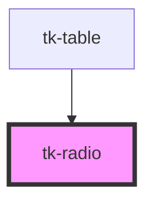

# tk-radio

<!-- Auto Generated Below -->

## Overview

The TkRadio component is another basic element for user input. You can use this to supply a way for the user to pick an option from multiple choices.

## Properties

| Property      | Attribute     | Description                                                        | Type                | Default     |
| ------------- | ------------- | ------------------------------------------------------------------ | ------------------- | ----------- |
| `checked`     | `checked`     | Marks the radio button as checked or unchecked.                    | `boolean`           | `false`     |
| `description` | `description` | The description sub text displayed.                                | `string`            | `undefined` |
| `disabled`    | `disabled`    | Disables the radio button if true.                                 | `boolean`           | `false`     |
| `invalid`     | `invalid`     | Indicates whether the input is in an invalid state                 | `boolean`           | `false`     |
| `label`       | `label`       | Defines the label for the element.                                 | `string`            | `undefined` |
| `name`        | `name`        | The name of the radio group, used to group radio buttons together. | `string`            | `undefined` |
| `position`    | `position`    | Determines the position of the radio and label.                    | `"left" \| "right"` | `undefined` |
| `value`       | `value`       | The value of the radio button.                                     | `any`               | `undefined` |

## Events

| Event       | Description                                            | Type               |
| ----------- | ------------------------------------------------------ | ------------------ |
| `tk-change` | Emitted when the radio button's checked state changes. | `CustomEvent<any>` |

## Slots

| Slot        | Description              |
| ----------- | ------------------------ |
| `"content"` | Custom content template. |

## Dependencies

### Used by

 - [tk-table](../tk-table)

### Graph

----------------------------------------------

*Built with [StencilJS](https://stenciljs.com/)*
