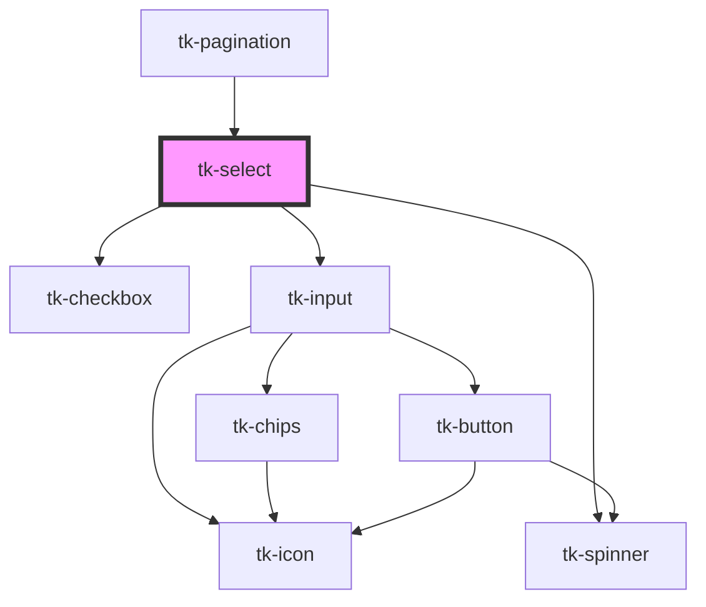

# tk-select

<!-- Auto Generated Below -->

## Overview

TkSelect component description.

## Properties

| Property              | Attribute               | Description                                                                                                                                           | Type                           | Default                  |
| --------------------- | ----------------------- | ----------------------------------------------------------------------------------------------------------------------------------------------------- | ------------------------------ | ------------------------ |
| `allowCustomValue`    | `allow-custom-value`    | Enables users to enter custom values that are not part of the predefined options.                                                                     | `boolean`                      | `false`                  |
| `chipOptions`         | `chip-options`          | Sets options for all chips rendered in multiple selection mode.                                                                                       | `IChipOptions`                 | `undefined`              |
| `clearable`           | `clearable`             | Indicates whether the input can be cleared                                                                                                            | `boolean`                      | `false`                  |
| `disabled`            | `disabled`              | If `true`, the user cannot interact with the input.                                                                                                   | `boolean`                      | `false`                  |
| `dropdownWidthMode`   | `dropdown-width-mode`   | Determines the width of the dropdown. Accepts values like 'match-parent', 'auto', or a specific width in '300px'.                                     | `string`                       | `'match-parent'`         |
| `editable`            | `editable`              | This property determines whether the input field within the select box is editable.                                                                   | `boolean`                      | `false`                  |
| `emptyMessage`        | `empty-message`         | The message to display when there is no data available.                                                                                               | `string`                       | `'No options available'` |
| `error`               | `error`                 | This is the error message that will be displayed.                                                                                                     | `string`                       | `undefined`              |
| `filter`              | `filter`                | Function used to filter current options based on the input value. Comes with a default filter function, but can be overridden with a custom function. | `Function`                     | `this.defaultFilter`     |
| `filterDebounceDelay` | `filter-debounce-delay` | Sets the delay (in ms) before triggering the filter function.                                                                                         | `number`                       | `0`                      |
| `groupNameKey`        | `group-name-key`        | The key to use for option group names. Required if grouped options are used.                                                                          | `string`                       | `'label'`                |
| `groupOptionsKey`     | `group-options-key`     | The key to use for accessing grouped options array. Required if grouped options are used.                                                             | `string`                       | `'options'`              |
| `hint`                | `hint`                  | Provided a hint or additional information about the input.                                                                                            | `string`                       | `undefined`              |
| `invalid`             | `invalid`               | Indicates whether the input is in an invalid state                                                                                                    | `boolean`                      | `false`                  |
| `label`               | `label`                 | Defines the label for the element.                                                                                                                    | `string`                       | `undefined`              |
| `loading`             | `loading`               | Represents whether the options are fethecd from service or not. If true renders spinner in options dropdown.                                          | `boolean`                      | `false`                  |
| `multiple`            | `multiple`              | If `true` the user can make multiple selections.                                                                                                      | `boolean`                      | `undefined`              |
| `name`                | `name`                  | The name of the control, which is submitted with the form data.                                                                                       | `string`                       | `undefined`              |
| `optionHtml`          | `option-html`           | Provides a function to customize the options.                                                                                                         | `Function`                     | `undefined`              |
| `optionLabelKey`      | `option-label-key`      | The key to use for option labels                                                                                                                      | `string`                       | `'label'`                |
| `optionValueKey`      | `option-value-key`      | The key to use for option values                                                                                                                      | `string`                       | `undefined`              |
| `options`             | `options`               | The list of options to be displayed in the select box.                                                                                                | `any[]`                        | `undefined`              |
| `placeholder`         | `placeholder`           | Placeholder text displayed when the input is empty.                                                                                                   | `string`                       | `undefined`              |
| `readonly`            | `readonly`              | If `true`, the user cannot modify the value.                                                                                                          | `boolean`                      | `false`                  |
| `showAsterisk`        | `show-asterisk`         | Displays a red asterisk (*) next to the label for visual emphasis.                                                                                    | `boolean`                      | `false`                  |
| `size`                | `size`                  | Sets size for the component.                                                                                                                          | `"base" \| "large" \| "small"` | `'base'`                 |
| `value`               | `value`                 | The value of the input.                                                                                                                               | `any`                          | `undefined`              |

## Events

| Event       | Description                         | Type               |
| ----------- | ----------------------------------- | ------------------ |
| `tk-change` | Emitted when the value has changed. | `CustomEvent<any>` |

## Slots

| Slot           | Description                                            |
| -------------- | ------------------------------------------------------ |
| `"empty-data"` | Set how the dropdown will appear when there is no data |

## Dependencies

### Used by

 - [tk-pagination](../tk-pagination)

### Depends on

- [tk-checkbox](../tk-checkbox)
- [tk-input](../tk-input)
- [tk-spinner](../tk-spinner)

### Graph

----------------------------------------------

*Built with [StencilJS](https://stenciljs.com/)*
