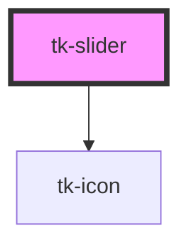

# tk-slider

<!-- Auto Generated Below -->

## Properties

| Property          | Attribute          | Description                                                                                                               | Type                         | Default     |
| ----------------- | ------------------ | ------------------------------------------------------------------------------------------------------------------------- | ---------------------------- | ----------- |
| `disabled`        | `disabled`         | Whether the slider is disabled (non-interactive if true)                                                                  | `boolean`                    | `false`     |
| `error`           | `error`            | Error message to display when `invalid` is true                                                                           | `string`                     | `undefined` |
| `hint`            | `hint`             | Informational hint message (shown when no error is present)                                                               | `string`                     | `undefined` |
| `invalid`         | `invalid`          | Marks the slider as invalid; used to apply error styling                                                                  | `boolean`                    | `false`     |
| `label`           | `label`            | The label text displayed above the slider                                                                                 | `string`                     | `undefined` |
| `max`             | `max`              | The maximum value the slider can take                                                                                     | `number`                     | `100`       |
| `min`             | `min`              | The minimum value the slider can take                                                                                     | `number`                     | `0`         |
| `range`           | `range`            | Whether the slider operates in range mode (true) or single value mode (false)                                             | `boolean`                    | `false`     |
| `rangeVisibility` | `range-visibility` | Whether the bottom label/tick section should be visible                                                                   | `boolean`                    | `true`      |
| `showAsterisk`    | `show-asterisk`    | Whether to show a red asterisk next to the label (typically for required fields)                                          | `boolean`                    | `false`     |
| `step`            | `step`             | The increment step for the slider value (e.g., step = 5 → 0, 5, 10, ...)                                                  | `number`                     | `1`         |
| `type`            | `type`             | The type of visual indicator shown below the track. 'labels' shows min/max values, 'ticks' shows evenly spaced tick marks | `"labels" \| "ticks"`        | `'labels'`  |
| `value`           | `value`            | Current value of the slider. If `range` is true, it should be [min, max]                                                  | `[number, number] \| number` | `0`         |

## Events

| Event      | Description                                                                                                  | Type                                      |
| ---------- | ------------------------------------------------------------------------------------------------------------ | ----------------------------------------- |
| `tkChange` | Emitted when the slider value changes. Emits a number for single mode, or a [min, max] tuple for range mode. | `CustomEvent<[number, number] \| number>` |

## Dependencies

### Depends on

- [tk-icon](../tk-icon)

### Graph

----------------------------------------------

*Built with [StencilJS](https://stenciljs.com/)*
