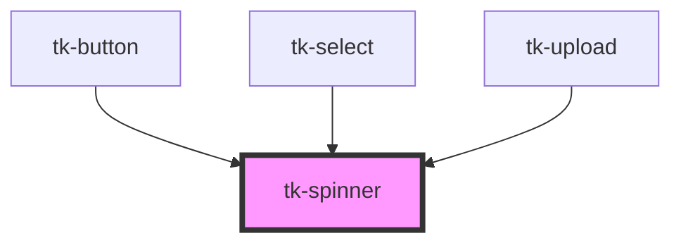

# tk-spinner

<!-- Auto Generated Below -->

## Overview

The `TkSpinner` component description.

## Properties

| Property      | Attribute     | Description                                        | Type                                                                    | Default      |
| ------------- | ------------- | -------------------------------------------------- | ----------------------------------------------------------------------- | ------------ |
| `label`       | `label`       | Sets the label of the spinner component.           | `string`                                                                | `undefined`  |
| `orientation` | `orientation` | Controls the orientation of the spinner component. | `"horizontal" \| "vertical"`                                            | `'vertical'` |
| `size`        | `size`        | Controls the size of the spinner component.        | `"base" \| "large" \| "small" \| "xlarge" \| "xsmall" \| "xxsmall"`     | `'base'`     |
| `type`        | `type`        | Sets the style of spinner component.               | `"dots" \| "lines" \| "loader" \| "pulse" \| "rounded" \| "three-dots"` | `'rounded'`  |

## Dependencies

### Used by

 - [tk-button](../tk-button)
 - [tk-select](../tk-select)
 - [tk-upload](../tk-upload)

### Graph

----------------------------------------------

*Built with [StencilJS](https://stenciljs.com/)*
