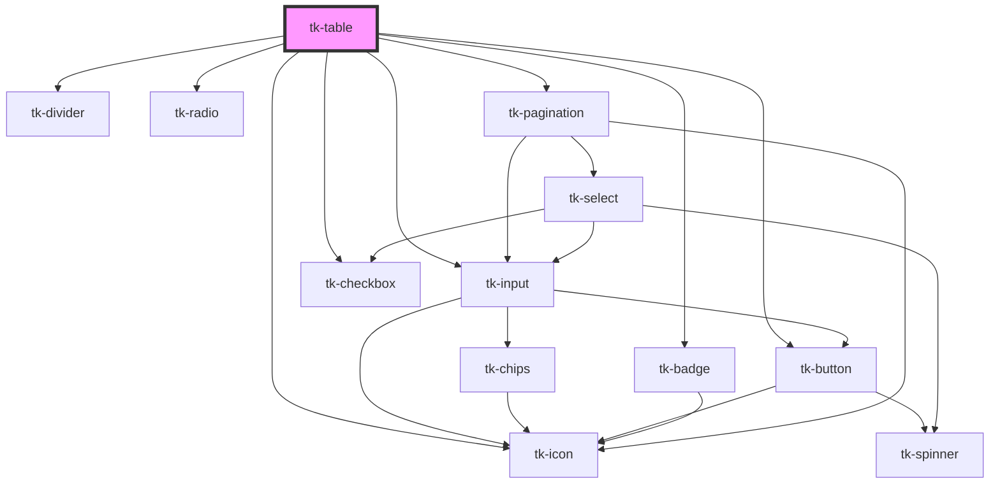

# tk-table

<!-- Auto Generated Below -->

## Overview

TkTable is a component that allows you to display data in a tabular manner. It's generally called a datatable.

## Properties

| Property               | Attribute                | Description                                                                                                                                        | Type                                      | Default      |
| ---------------------- | ------------------------ | -------------------------------------------------------------------------------------------------------------------------------------------------- | ----------------------------------------- | ------------ |
| `cardTitle`            | `card-title`             |                                                                                                                                                    | `string`                                  | `''`         |
| `cellStyle`            | `cell-style`             | Provides a function to customize cell styles. This function takes the row and column information and returns the style object for a specific cell. | `(row: any, column: ITableColumn) => any` | `undefined`  |
| `columns`              | `columns`                | The column definitions (Array of Objects)                                                                                                          | `ITableColumn[]`                          | `[]`         |
| `containerStyle`       | `container-style`        | The style attribute of container element                                                                                                           | `any`                                     | `null`       |
| `data`                 | `data`                   | Rows of data to display                                                                                                                            | `any[]`                                   | `[]`         |
| `dataKey`              | `data-key`               | Property of each row that defines the unique key of each row                                                                                       | `string`                                  | `undefined`  |
| `expandedRows`         | `expanded-rows`          | Specifies which rows are expanded to show additional content.                                                                                      | `any[]`                                   | `[]`         |
| `headerType`           | `header-type`            | Style to apply to header of table                                                                                                                  | `"basic" \| "dark" \| "primary"`          | `'basic'`    |
| `loading`              | `loading`                | Displays a loading indicator while data is being fetched or processed.                                                                             | `boolean`                                 | `undefined`  |
| `multiSort`            | `multi-sort`             | Enables multi-column sorting.                                                                                                                      | `boolean`                                 | `false`      |
| `paginationMethod`     | `pagination-method`      | Defines whether pagination is handled on the client or server side.                                                                                | `string`                                  | `undefined`  |
| `paginationType`       | `pagination-type`        | The type of the pagination                                                                                                                         | `"grouped" \| "outlined" \| "text"`       | `'outlined'` |
| `rowStyle`             | `row-style`              | Provides a function to customize row styles. This function takes row information and row index, and returns the style object for a specific  row.  | `(row: any, index?: number) => any`       | `undefined`  |
| `rowsPerPage`          | `rows-per-page`          | Number of items per page.                                                                                                                          | `number`                                  | `6`          |
| `rowsPerPageOptions`   | `rows-per-page-options`  | Number of rows per page options                                                                                                                    | `number[]`                                | `undefined`  |
| `selection`            | `selection`              | List of the selected                                                                                                                               | `any`                                     | `[]`         |
| `selectionMode`        | `selection-mode`         | Determines how rows can be selected, either with radio buttons (single selection) or checkboxes (multiple selection).                              | `"checkbox" \| "radio"`                   | `undefined`  |
| `selectionRowDisabled` | `selection-row-disabled` | A function that returns true if the row should be disabled                                                                                         | `Function`                                | `undefined`  |
| `size`                 | `size`                   | Sets size for the component.                                                                                                                       | `"base" \| "small" \| "xsmall"`           | `'base'`     |
| `striped`              | `striped`                | Enables or disables alternating row background colors for easier readability.                                                                      | `boolean`                                 | `false`      |
| `totalItems`           | `total-items`            | Number of total items.                                                                                                                             | `number`                                  | `undefined`  |

## Events

| Event                     | Description                                            | Type                          |
| ------------------------- | ------------------------------------------------------ | ----------------------------- |
| `tk-cell-edit`            | Emitted when a cell is edited.                         | `CustomEvent<ITableCellEdit>` |
| `tk-expanded-rows-change` | Emitted when the expanded rows change.                 | `CustomEvent<any[]>`          |
| `tk-request`              | Emitted when a request needs to be made to the server. | `CustomEvent<ITableRequest>`  |
| `tk-row-click`            | Emitted when a row is clicked.                         | `CustomEvent<any>`            |
| `tk-selection-change`     |                                                        | `CustomEvent<any>`            |

## Methods

### `clearFilters() => Promise<void>`

Clears all filters for server side pagination

#### Returns

Type: `Promise<void>`

### `clearSorting() => Promise<void>`

Clears all sorting for server side pagination

#### Returns

Type: `Promise<void>`

### `exportFile(options: ITableExportOptions) => Promise<void>`

Exports the table data to a file

#### Parameters

| Name      | Type                  | Description |
| --------- | --------------------- | ----------- |
| `options` | `ITableExportOptions` |             |

#### Returns

Type: `Promise<void>`

### `getFilters() => Promise<ITableFilter[]>`

Returns the current filters

#### Returns

Type: `Promise<ITableFilter[]>`

The current filters

### `getSorting() => Promise<{ field: string; order: "desc" | "asc"; }>`

Returns the current sorting settings

#### Returns

Type: `Promise<{ field: string; order: "desc" | "asc"; }>`

The current sorting settings

### `serverRequest() => Promise<void>`

Allows tk-request event to be triggered manually

#### Returns

Type: `Promise<void>`

### `setCurrentPage(page: number) => Promise<void>`

#### Parameters

| Name   | Type     | Description |
| ------ | -------- | ----------- |
| `page` | `number` |             |

#### Returns

Type: `Promise<void>`

## Slots

| Slot           | Description                                         |
| -------------- | --------------------------------------------------- |
| `"empty-data"` | Set how the table will appear when there is no data |

## Dependencies

### Depends on

- [tk-input](../tk-input)
- [tk-checkbox](../tk-checkbox)
- [tk-divider](../tk-divider)
- [tk-radio](../tk-radio)
- [tk-button](../tk-button)
- [tk-icon](../tk-icon)
- [tk-badge](../tk-badge)
- [tk-pagination](../tk-pagination)

### Graph

----------------------------------------------

*Built with [StencilJS](https://stenciljs.com/)*
