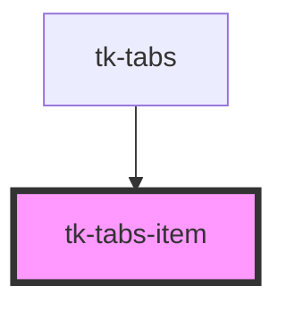

# tk-tabs-item

<!-- Auto Generated Below -->

## Properties

| Property         | Attribute         | Description                                                                                                                            | Type                     | Default     |
| ---------------- | ----------------- | -------------------------------------------------------------------------------------------------------------------------------------- | ------------------------ | ----------- |
| `badgeCount`     | `badge-count`     | Sets badge component's count.                                                                                                          | `number \| string`       | `undefined` |
| `badgeLabel`     | `badge-label`     | **[DEPRECATED]** since version 0.0.40. Use 'badgeCount' instead.  Sets badge component's label. | `string`                 | `undefined` |
| `badged`         | `badged`          | Checks if tab item has badge component or not.                                                                                         | `boolean`                | `false`     |
| `disabled`       | `disabled`        | Whether the tab item is disabled.                                                                                                      | `boolean`                | `undefined` |
| `icon`           | `icon`            | Icon for tabs item component.                                                                                                          | `IIconOptions \| string` | `undefined` |
| `label`          | `label`           | Label for the tab item.                                                                                                                | `string`                 | `undefined` |
| `tooltipOptions` | `tooltip-options` | Sets tooltip options for the tab item.                                                                                                 | `ITooltipOptions`        | `undefined` |

## Dependencies

### Used by

 - [tk-tabs](.)

### Graph

----------------------------------------------

*Built with [StencilJS](https://stenciljs.com/)*
