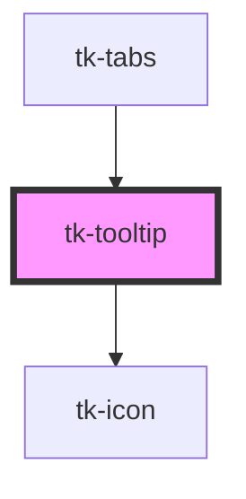

# tk-tooltip

<!-- Auto Generated Below -->

## Overview

The TkTooltip is used to display additional information when element is hovered over.

## Properties

| Property         | Attribute         | Description                              | Type                                                                                                                                                                 | Default     |
| ---------------- | ----------------- | ---------------------------------------- | -------------------------------------------------------------------------------------------------------------------------------------------------------------------- | ----------- |
| `containerStyle` | `container-style` | The style attribute of container element | `any`                                                                                                                                                                | `null`      |
| `description`    | `description`     | Sets description text for the tooltip.   | `string`                                                                                                                                                             | `undefined` |
| `header`         | `header`          | Sets header text for the tooltip.        | `string`                                                                                                                                                             | `undefined` |
| `icon`           | `icon`            | Sets the icon element of the tooltip.    | `IIconOptions \| string`                                                                                                                                             | `undefined` |
| `position`       | `position`        | Sets the position of the tooltip.        | `"bottom" \| "bottom-end" \| "bottom-start" \| "left" \| "left-end" \| "left-start" \| "right" \| "right-end" \| "right-start" \| "top" \| "top-end" \| "top-start"` | `'right'`   |
| `variant`        | `variant`         | Sets the color variant of the tooltip.   | `"danger" \| "dark" \| "info" \| "neutral" \| "success" \| "warning" \| "white"`                                                                                     | `'neutral'` |

## Slots

| Slot        | Description                                                                                                  |
| ----------- | ------------------------------------------------------------------------------------------------------------ |
| `"content"` | Define custom HTML content for the tooltip, which replaces the default header, description and icon elements |
| `"trigger"` | The trigger slot defines the element that will trigger the tooltip                                           |

## Dependencies

### Used by

 - [tk-tabs](../tk-tabs)

### Depends on

- [tk-icon](../tk-icon)

### Graph

----------------------------------------------

*Built with [StencilJS](https://stenciljs.com/)*
