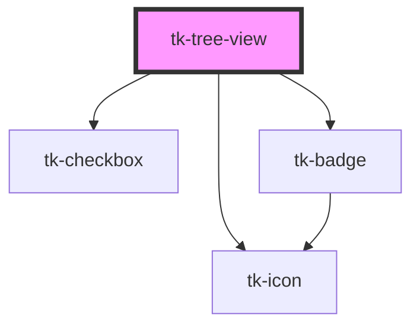

# tk-tree-view

<!-- Auto Generated Below -->

## Overview

The `TkTreeview` component displays hierarchical data in a tree structure with expandable/collapsible nodes.
Uses array-based data structure for better performance and easier data management.

## Properties

| Property       | Attribute       | Description                                                                         | Type                              | Default     |
| -------------- | --------------- | ----------------------------------------------------------------------------------- | --------------------------------- | ----------- |
| `badgeOptions` | `badge-options` | Badge customization options for children count display.                             | `IBadgeOptions`                   | `undefined` |
| `branchIcon`   | `branch-icon`   | Icon for branch items (items with children). When empty, no icon is shown.          | `string`                          | `''`        |
| `disabled`     | `disabled`      | If true, disables all interaction with the tree view.                               | `boolean`                         | `false`     |
| `items`        | `items`         | Array of tree items data. This is the primary way to provide data to the tree view. | `ITreeItem[]`                     | `[]`        |
| `leafIcon`     | `leaf-icon`     | Icon for leaf items (items without children). When empty, no icon is shown.         | `string`                          | `''`        |
| `mode`         | `mode`          | Tree view mode: 'basic' or 'stepper'.                                               | `"basic" \| "stepper"`            | `'basic'`   |
| `selectable`   | `selectable`    | If true, enables checkbox selection for tree items.                                 | `boolean`                         | `false`     |
| `showBadge`    | `show-badge`    | Show/hide the badge for children count on directories.                              | `boolean`                         | `true`      |
| `showPointer`  | `show-pointer`  | Show/hide the pointer icon for selected items.                                      | `boolean`                         | `true`      |
| `size`         | `size`          | Tree view size: 'large', 'base' or 'small'.                                         | `"base" \| "large" \| "small"`    | `'base'`    |
| `type`         | `type`          | Tree view type: 'basic', 'divided', or 'light'.                                     | `"basic" \| "divided" \| "light"` | `'basic'`   |
| `value`        | `value`         | The value of the selected tree item.                                                | `string[]`                        | `undefined` |

## Events

| Event           | Description                                    | Type                     |
| --------------- | ---------------------------------------------- | ------------------------ |
| `tk-change`     | Event emitted when the selected value changes. | `CustomEvent<string[]>`  |
| `tk-item-click` | Event emitted when a tree item is clicked.     | `CustomEvent<ITreeItem>` |

## Dependencies

### Depends on

- [tk-icon](../tk-icon)
- [tk-checkbox](../tk-checkbox)
- [tk-badge](../tk-badge)

### Graph

----------------------------------------------

*Built with [StencilJS](https://stenciljs.com/)*
