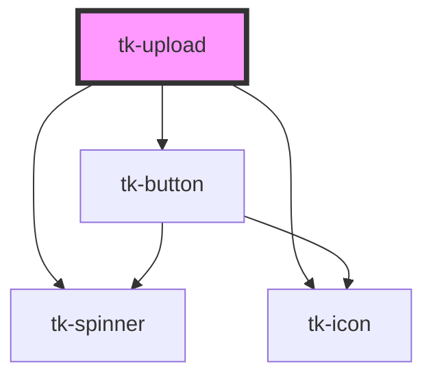

# tk-upload

<!-- Auto Generated Below -->

## Overview

The TkUpload component is an interface element that allows users to select and upload files from their devices to a server or a target location. It typically includes a "Choose File" button and a field displaying the selected file's name. This component simplifies the process of file selection and uploading.

## Properties

| Property              | Attribute               | Description                                                                                                                                             | Type                      | Default                                          |
| --------------------- | ----------------------- | ------------------------------------------------------------------------------------------------------------------------------------------------------- | ------------------------- | ------------------------------------------------ |
| `accept`              | `accept`                | Acceptable file types for upload. Use MIME types or extensions separated by commas.                                                                     | `string`                  | `'*'`                                            |
| `autoUpload`          | `auto-upload`           | If `autoUpload` is set to `true`, the upload button will be hidden, and the `tkUpload` event will be automatically triggered for each newly added file. | `boolean`                 | `false`                                          |
| `chooseButtonLabel`   | `choose-button-label`   | Label text displayed inside the choose button.                                                                                                          | `string`                  | `'Choose File'`                                  |
| `description`         | `description`           | Description displayed under the title.                                                                                                                  | `string`                  | `'JPEG, PNG, PDF and MP4 formats, up to 50 MB.'` |
| `disabled`            | `disabled`              | Disables the input, preventing user interaction.                                                                                                        | `boolean`                 | `false`                                          |
| `downloadable`        | `downloadable`          | Indicates whether the files can be downloaded. When true, a download button will be displayed next to each file.                                        | `boolean`                 | `false`                                          |
| `dragDrop`            | `drag-drop`             | Enables drag and drop functionality for file uploads.                                                                                                   | `boolean`                 | `true`                                           |
| `dragDropDescription` | `drag-drop-description` | Description displayed under the title when drag and drop is active.                                                                                     | `string`                  | `'Release to upload files'`                      |
| `dragDropTitle`       | `drag-drop-title`       | Title displayed in the upload component when drag and drop is active.                                                                                   | `string`                  | `'Drop files here'`                              |
| `error`               | `error`                 | Provided a error about the upload.                                                                                                                      | `string`                  | `undefined`                                      |
| `hint`                | `hint`                  | Provided a hint or additional information about the input.                                                                                              | `string`                  | `undefined`                                      |
| `invalid`             | `invalid`               | Indicates whether the upload is in an invalid state, uploads will fail eventually                                                                       | `boolean`                 | `false`                                          |
| `label`               | `label`                 | Defines the label of the upload area                                                                                                                    | `string`                  | `undefined`                                      |
| `loading`             | `loading`               | Indicates whether the upload is in an loading state                                                                                                     | `boolean`                 | `false`                                          |
| `maxFileCount`        | `max-file-count`        | Maximum allowed file count                                                                                                                              | `number`                  | `undefined`                                      |
| `maxFileSize`         | `max-file-size`         | Maximum allowed file size in bytes.                                                                                                                     | `number`                  | `undefined`                                      |
| `multiple`            | `multiple`              | Allows multiple file selection.                                                                                                                         | `boolean`                 | `false`                                          |
| `showAsterisk`        | `show-asterisk`         | Displays a red asterisk (*) next to the label for visual emphasis.                                                                                      | `boolean`                 | `false`                                          |
| `showFiles`           | `show-files`            | Displays the uploaded files.                                                                                                                            | `boolean`                 | `true`                                           |
| `title`               | `title`                 | Title displayed in the upload component.                                                                                                                | `string`                  | `'Choose a file or drag & drop it here.'`        |
| `type`                | `type`                  | Type of the file upload area.                                                                                                                           | `"centered" \| "default"` | `'default'`                                      |
| `uploadButtonLabel`   | `upload-button-label`   | Label text displayed inside the upload button.                                                                                                          | `string`                  | `'Upload'`                                       |
| `value`               | `value`                 | The file value of the upload.                                                                                                                           | `File[]`                  | `[]`                                             |

## Events

| Event               | Description                                                   | Type                                                         |
| ------------------- | ------------------------------------------------------------- | ------------------------------------------------------------ |
| `tk-change`         | Emitted when one or more files pass validation.               | `CustomEvent<File[]>`                                        |
| `tk-download-file`  | Emitted when a file is download button is clicked.            | `CustomEvent<File>`                                          |
| `tk-files-rejected` | Emitted when one or more files fail validation, with reasons. | `CustomEvent<{ reason: string; file: File \| FileList; }[]>` |
| `tk-removed-file`   | Emitted when a file is removed from the accepted list.        | `CustomEvent<File>`                                          |
| `tk-upload`         | Emitted when the user initiates file upload.                  | `CustomEvent<File[]>`                                        |

## Dependencies

### Depends on

- [tk-spinner](../tk-spinner)
- [tk-icon](../tk-icon)
- [tk-button](../tk-button)

### Graph

----------------------------------------------

*Built with [StencilJS](https://stenciljs.com/)*
