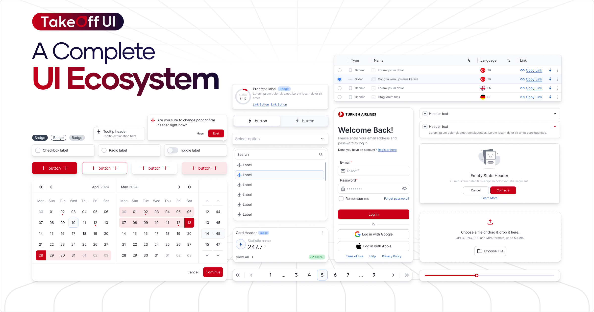

# @takeoff-ui/vue



[](https://www.npmjs.com/package/@takeoff-ui/vue)
[](https://www.npmjs.com/package/@takeoff-ui/vue)

Vue bindings for the Takeoff UI Design System. This package exposes Vue components that wrap the framework‑agnostic web components in `@takeoff-ui/core` (built with Stencil.js), giving you a smooth Vue developer experience.

## Documentation

- Full docs: [Introduction](https://takeoff-ui-blond.vercel.app/docs/Introduction)
- Getting started: [Installation Guide](https://takeoff-ui-blond.vercel.app/docs/Installation)
- Component APIs and examples: [Components Overview](https://takeoff-ui-blond.vercel.app/docs/Components/Overview)

## Installation

Install the Vue bindings. `@takeoff-ui/core` is required at runtime since the Vue wrappers use the underlying web components.

```bash
npm install @takeoff-ui/vue @takeoff-ui/core
# or
pnpm add @takeoff-ui/vue @takeoff-ui/core
# or
yarn add @takeoff-ui/vue @takeoff-ui/core
```

## Quick Start

1) Register the custom elements and import global styles:

- main.ts
```ts
import { createApp } from 'vue';
import App from './App.vue';
import { ComponentLibrary } from '@takeoff-ui/vue';
import '@takeoff-ui/core/dist/core/core.css';

createApp(App)
  .use(ComponentLibrary) // registers custom elements via defineCustomElements()
  .mount('#app');
```

2) Use Vue components:

```vue
<!-- App.vue -->
<template>
  <div style="display: grid; gap: 12px">
    <TkButton label="Click me" variant="primary" />
    <TkInput v-model="value" placeholder="Type here..." />
  </div>
</template>

<script setup lang="ts">
import { ref } from 'vue';
import { TkButton, TkInput } from '@takeoff-ui/vue';

const value = ref('');
</script>
```

## Features

- Vue wrappers for all Takeoff UI components (e.g., `TkButton`, `TkInput`, `TkDialog`, ...)
- v-model support where applicable
- Typed props and events
- Works with Vite, Vue CLI, Nuxt 3

## Theming and Tailwind CSS (Optional)

Takeoff UI ships with a Tailwind CSS plugin for tokens and utilities.

- [Tailwind CSS Plugin](https://takeoff-ui-blond.vercel.app/docs/Tailwind)

## Contributing

We welcome contributions! Please read the guide for details on issues, PRs, and coding standards.
- [Contribution guide](https://takeoff-ui-blond.vercel.app/docs/CONTRIBUTING)

## License

Licensed under the Apache 2.0 License. See the repository root `LICENSE` file.

## Contributors

<a href="https://github.com/turkishtechnology/takeoff-ui/graphs/contributors">
  
</a>